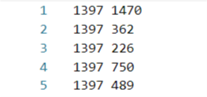

# GraphEmbedding

# Method


|   Model   | Paper                                                                                                                      | Note                                                                                        |
| :-------: | :------------------------------------------------------------------------------------------------------------------------- | :------------------------------------------------------------------------------------------ |
| DeepWalk  | [KDD 2014][DeepWalk: Online Learning of Social Representations](http://www.perozzi.net/publications/14_kdd_deepwalk.pdf)   | [【Graph Embedding】DeepWalk：算法原理，实现和应用](https://zhuanlan.zhihu.com/p/56380812)  |
|   LINE    | [WWW 2015][LINE: Large-scale Information Network Embedding](https://arxiv.org/pdf/1503.03578.pdf)                          | [【Graph Embedding】LINE：算法原理，实现和应用](https://zhuanlan.zhihu.com/p/56478167)      |
| Node2Vec  | [KDD 2016][node2vec: Scalable Feature Learning for Networks](https://www.kdd.org/kdd2016/papers/files/rfp0218-groverA.pdf) | [【Graph Embedding】Node2Vec：算法原理，实现和应用](https://zhuanlan.zhihu.com/p/56542707)  |
|   SDNE    | [KDD 2016][Structural Deep Network Embedding](https://www.kdd.org/kdd2016/papers/files/rfp0191-wangAemb.pdf)               | [【Graph Embedding】SDNE：算法原理，实现和应用](https://zhuanlan.zhihu.com/p/56637181)      |
| Struc2Vec | [KDD 2017][struc2vec: Learning Node Representations from Structural Identity](https://arxiv.org/pdf/1704.03165.pdf)        | [【Graph Embedding】Struc2Vec：算法原理，实现和应用](https://zhuanlan.zhihu.com/p/56733145) |


# How to run examples
1. clone the repo and make sure you have installed `tensorflow` or `tensorflow-gpu` on your local machine. 
2. run following commands
```bash
python setup.py install
cd examples
python deepwalk_wiki.py
```

## DisscussionGroup & Related Projects

<html>
    <table style="margin-left: 20px; margin-right: auto;">
        <tr>
            <td>
                公众号：<b>浅梦的学习笔记</b><br><br>
                <a href="https://github.com/shenweichen/GraphEmbedding">
  
</a>
            </td>
            <td>
                微信：<b>deepctrbot</b><br><br>
 <a href="https://github.com/shenweichen/GraphEmbedding">
  
</a>
            </td>
            <td>
<ul>
<li><a href="https://github.com/shenweichen/AlgoNotes">AlgoNotes</a></li>
<li><a href="https://github.com/shenweichen/DeepCTR">DeepCTR</a></li>
<li><a href="https://github.com/shenweichen/DeepMatch">DeepMatch</a></li>
<li><a href="https://github.com/shenweichen/DeepCTR-Torch">DeepCTR-Torch</a></li>
</ul>
            </td>
        </tr>
    </table>
</html>

# Usage
The design and implementation follows simple principles(**graph in,embedding out**) as much as possible.
## Input format
we use `networkx`to create graphs.The input of networkx graph is as follows:
`node1 node2 <edge_weight>`


## DeepWalk

```python
G = nx.read_edgelist('../data/wiki/Wiki_edgelist.txt',create_using=nx.DiGraph(),nodetype=None,data=[('weight',int)])# Read graph

model = DeepWalk(G,walk_length=10,num_walks=80,workers=1)#init model
model.train(window_size=5,iter=3)# train model
embeddings = model.get_embeddings()# get embedding vectors
```

## LINE

```python
G = nx.read_edgelist('../data/wiki/Wiki_edgelist.txt',create_using=nx.DiGraph(),nodetype=None,data=[('weight',int)])#read graph

model = LINE(G,embedding_size=128,order='second') #init model,order can be ['first','second','all']
model.train(batch_size=1024,epochs=50,verbose=2)# train model
embeddings = model.get_embeddings()# get embedding vectors
```
## Node2Vec
```python
G=nx.read_edgelist('../data/wiki/Wiki_edgelist.txt',
                        create_using = nx.DiGraph(), nodetype = None, data = [('weight', int)])#read graph

model = Node2Vec(G, walk_length = 10, num_walks = 80,p = 0.25, q = 4, workers = 1)#init model
model.train(window_size = 5, iter = 3)# train model
embeddings = model.get_embeddings()# get embedding vectors
```
## SDNE

```python
G = nx.read_edgelist('../data/wiki/Wiki_edgelist.txt',create_using=nx.DiGraph(),nodetype=None,data=[('weight',int)])#read graph

model = SDNE(G,hidden_size=[256,128]) #init model
model.train(batch_size=3000,epochs=40,verbose=2)# train model
embeddings = model.get_embeddings()# get embedding vectors
```

## Struc2Vec


```python
G = nx.read_edgelist('../data/flight/brazil-airports.edgelist',create_using=nx.DiGraph(),nodetype=None,data=[('weight',int)])#read graph

model = model = Struc2Vec(G, 10, 80, workers=4, verbose=40, ) #init model
model.train(window_size = 5, iter = 3)# train model
embeddings = model.get_embeddings()# get embedding vectors
```
